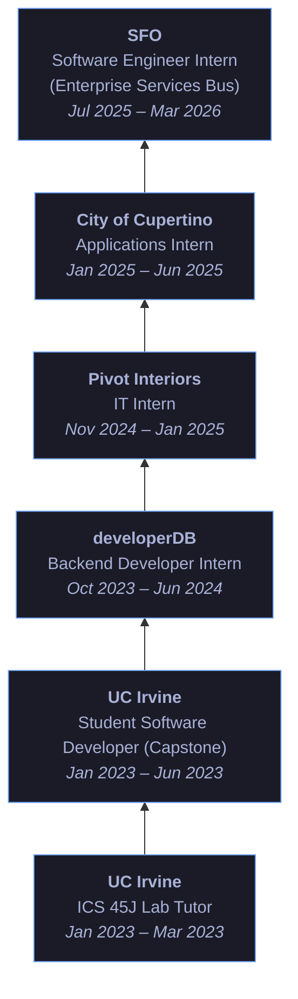

<!-- Header Banner -->

<!-- Social Badges -->
 

---

> Most recently, I interned at **San Francisco International Airport (SFO)** where I learend to build production applications. I gained expereince in designing efficient APIs, working with streaming data pipelines, and delivering user-friendly scalable software.

> I'm currently finishing my Master's at Santa Clara University and looking for my next opportunity to build impactful software.

---

## Experience

---

## Tech Stack

### Languages

### Frameworks & Libraries

### Tools & Platforms

---

## Education

| Degree | School | Period |
|--------|--------|--------|
| **M.S. Computer Science & Engineering** | Santa Clara University | Sep 2024 – Jun 2026 |
| **B.S. Computer Science**   *Minor in Informatics* | University of California, Irvine | Sep 2020 – Jun 2024 |

---

